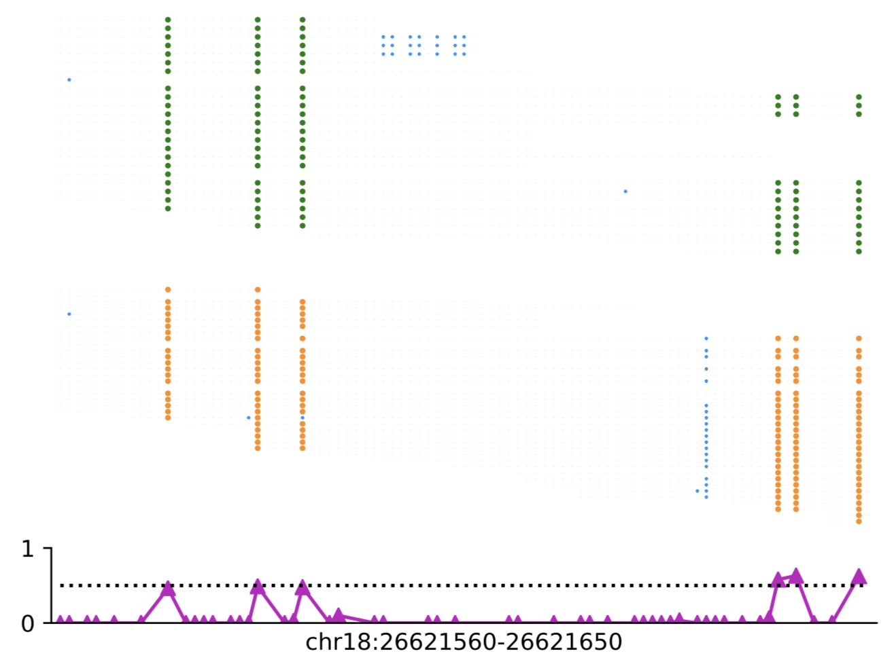
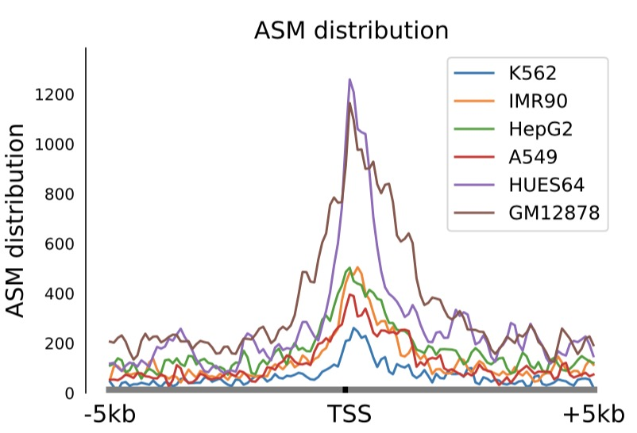

## MethyHaplo: Combining Allele-specific DNA Methylation and SNPs for Haplotype Assembly

DNA methylation is an important epigenetic modification that plays a critical role in most eukaryotic organisms. Parental alleles in haploids may exhibit different methylation patterns, which can lead to different phenotypes, and even different therapeutic and drug responses to diseases. However, there is currently no suitable software to obtain accurate DNA methylation haplotype results to our knowledge. To address this issue, we developed a new method, MethyHaplo, for haplotype assembly with allele-specific DNA methylation and SNPs from whole-genome bisulfite sequencing (WGBS) data. Our results showed that the haplotype assembly with allele-specific DNA methylation and SNPs was ten times longer than that with just SNPs. Moreover, MethyHaplo could integrate WGBS-Seq and Hi-C to obtain the better haplotype results. 

## This is a README file for the usage of MethyHaplo.
------

## REQUIREMENTS
1. gcc (v4.8) , gsl library
2. SAMtools
3. Python3
4. Perl

## INSTALL
------
a) Download
`git clone https://github.com/ZhouQiangwei/MethyHaplo.git`

b) Change directory into the top directory of MethyHaplo
`cd MethyHaplo`

c) Type
- make
- make install

d) The binary of MethyHaplo will be created in current folder

## USAGE of MethyHaplo
------
### Example data
You can download the test data on 

### Usage
#### 1. MethyHaplo command
```
        MethyHaplo: Combining Allele-specific DNA Methylation and SNPs for Haplotype Assembly
        Usage: methyhaplo -M [mode] -a Y -m methfile -s <sam>/-b <bam> -o outputprefix
        Options:
           -M <string> [hap|asm]         methyhaolo analysis mode
                                             hap: iterative approach, prefer longer haplotype results;
                                             asm: hypergeometric approach, prefer accurate asm results.(default: hap);
           -m, --methfile <file>         methratio file (requires)
                                             format: chr  pos  strand  context  methlevel  methC  coverage
           -o, --out <string>            output file prefix
           -s, --sam <samfile>           sam file from batmeth2-align.  This file should be coordinate sorted, 
                                             using the <samtools sort> command, and must contain methylstatus[MD:Z:].
           -b, --bam <bamfile>           bam file, should be coordinate sorted. (use this option or -s option but not both)
           -a <Y/N>                      If bam/sam file contain MD state by batmeth2 calmeth scripts.
                                             If not, please define genome location by -g paramater.
           -g, --genome <genome>         If bam/sam file isnot contain MD.
           -q <int>                      only process reads with mapping quality >= INT [default >= 20].
           -c, --context                 methylation context process for methyhaplo. CG, CHG, CHH, ALL[default].
           -C, --NMETH                   Number of methylated reads cover cytosine site. default: 2 [m>=2]
           -N, --NCOVER                  Number of coverage reads in cytosine site. default: 6 [n >= 6]
	       -f, --MFloat                  Cutoff of methratio. default: 0.2 [ f =< meth <= 1-f]
	       --minIS <INT>                 Minimum insert size for a paired-end read to be considered as single fragment for phasing, default 0
	       --maxIS <INT>                 Maximum insert size for a paired-end read to be considered as a single fragment for phasing, default 1000
	       --DBtmpsize <INT>             Maximum size of temp read store, default 12000. (only useful in asm mode)
           --PE                          Paired-end reads.[default:single-end]
           -v, --vcffile <file>          snp file (optional)
           -r, --chromosomal-order       Use natural ordering (1,2,10,MT,X) rather then the default (1,10,2,MT,X). 
                                             This requires new version of the unix \sort\ command which supports the --version-sort option.
           -p, --parallel <int>          Change the number of sorts run concurrently to <int>
           -t, --temporary-directory     Use a directory other than /tmp as the temporary directory for sorting.
           -h, -?, --help                This help message.
```

#### 2. Allele-specific DNA methylation region visualization
```bash
python methpoint.py align.md.sort.bam chrom:start-end strand outputprefix visulsort

        [align.md.sort.bam] BS-Seq alignment file for visualization.
        [chrom:start-end] The region in chromosome:start-end for visualization.
        [strand] visualization strand. [+/-/.]
        [outputprefix] output file prefix
        [visulsort] Methylation and Unmethylation position in the figure. [0/1]
```

<p align="center">
        
</p>

    The figure above represents the distribution of methylation sites in raw reads, orange represents methylation sites, green represents unmethylation sites, and blue represents mutation base information. The following figure shows DNA methylation sites and methylation levels.

#### 3. Aellele-specific DNA methylation Sites distribution across TSS/TES etc.

##### 3.1 Caculate coverage across TSS/TES sites.

```bash
ASManno [options] -o <OUT_PREFIX> -G GENOME -gff <GFF file>/-gtf <GTF file>/-b <bed file> -ap <asm plus file> -an <asm neg file>
Usage:
	-o|--out         Output file prefix
	-G|--genome      Genome
	-ap|--asmplus    ASM plus file.
	-an|--asmneg     ASM neg file.
	-p|--pvale       Pvalue cutoff. default: 0.01
	-gtf|-gff        Gtf/gff file
	-b|--BED         Bed file, chrom start end (strand, .bed4 format)
	--ped            loci file, chrom start (strand, .ped3 format)
	-d|--distance    ASM distributions in body and <INT>-bp flanking sequences. The distance of upstream and downstream. default:2000
	-B|--body        For different analysis input format, gene/TEs body methylation level. [Different Methylation Gene(DMG/DMT...)]
	-P|--promoter    For different analysis input format.[Different Methylation Promoter(DMP)]
	-s|--step        Gene body and their flanking sequences using an overlapping sliding window of 5% of the sequence length at a step of 0.8% of the sequence length. So default step: 0.008 (0.8%)
	-h|--help
```

##### 3.2 Visualization

```bash
python methylevel.py Num Input1.Methylevel.1.txt [Input2 ...] lable outprefix
```
<p align="center">
        
</p>


